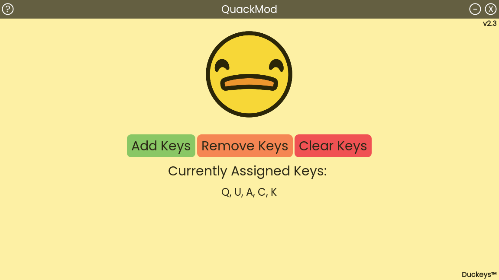

# QuackMod 2.0

Welcome to QuackMod 2.0, a Godot rewrite of the original QuackMod software.

Written for, and intended to be used alongside, Duckeys keycaps. Go check them out [here](https://duckeys.com)!

## Why Rewrite?

The driving factors behind this rewrite were the following:
- Migrate away from the Python GUI library, due to license changes and lack of ability to turn off automatic update checking
- Enable bundling of the executables without using `pyinstaller`, since it very commonly false positive triggers antivirus programs
- (Slightly) simpler process of exporting to Mac from one codebase, involving basically no OS-specific branches

## Why Godot?

If you're unfamiliar with Godot, it is a game engine. Obviously, QuackMod is not a game. So why did I choose Godot? 

This is actually a pretty straightforward answer.

- This program requires capturing input, displaying a menu GUI, and playing sound. Those are all crucial components to video games, so they're all assuredly built in
- I'm not a desktop application developer, so tapping into my existing Godot knowledge made the process much smoother
- Existing documentation for exporting Mac apps from Windows, which was very important
- No forced internet connection, no false positive virus flags, and no weird licensing considerations

The only downside I've noticed is that the app file is larger, now clocking in around 110MB. This is mostly due to the amount of other game framework stuff that needs to be bundled in the executable but isn't used by the program. The app file is still plenty small for modern machines, so all of the pros far outweighed this change.

## Licensing

Contributions are welcome, but redistribution of any sort is not allowed.  
  
Duckeys, as well as the output executable, is owned by Duckeys, LLC. All rights reserved.
